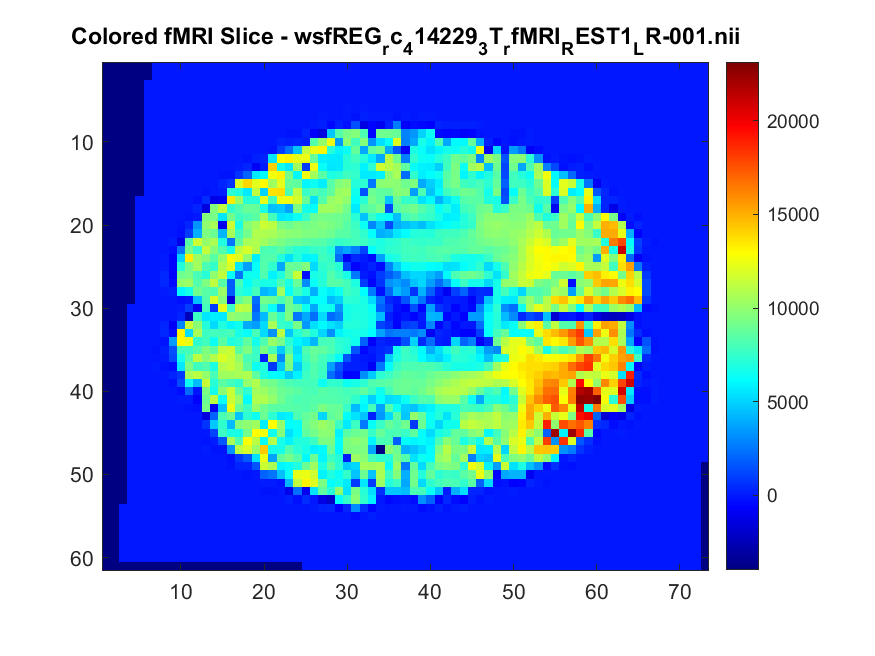
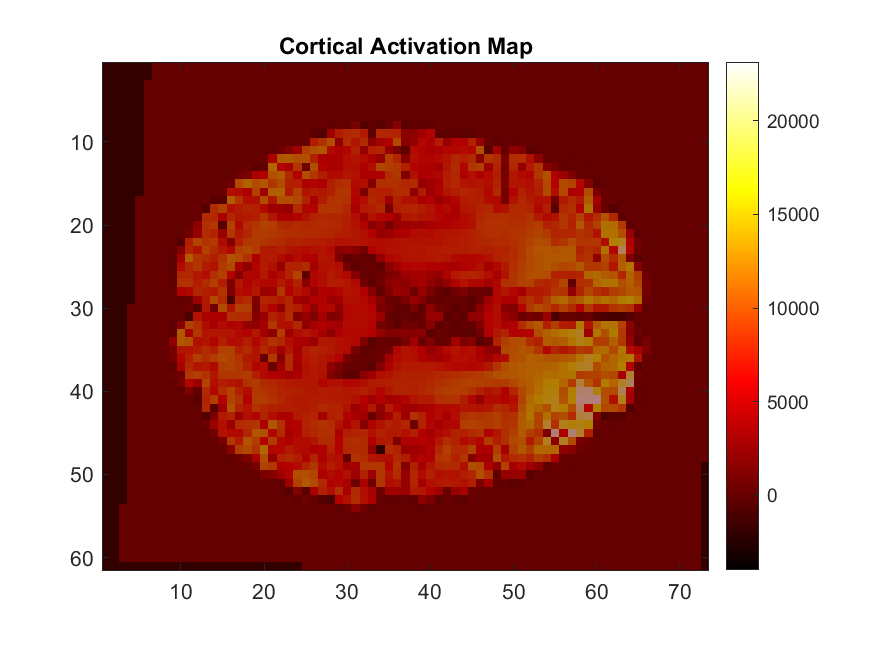
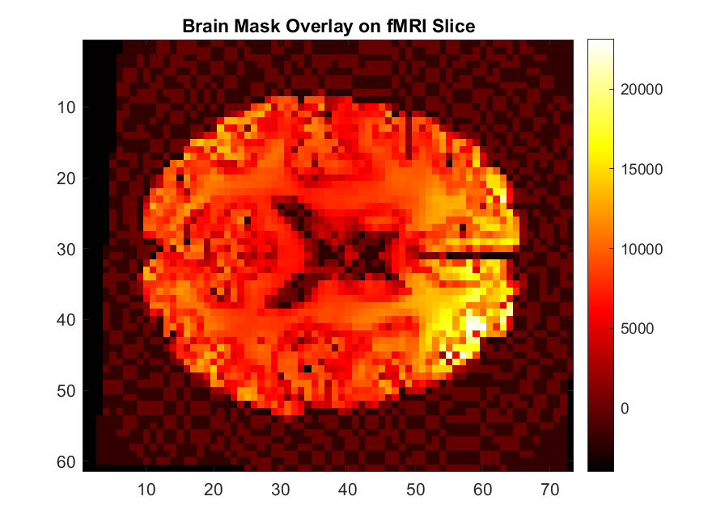
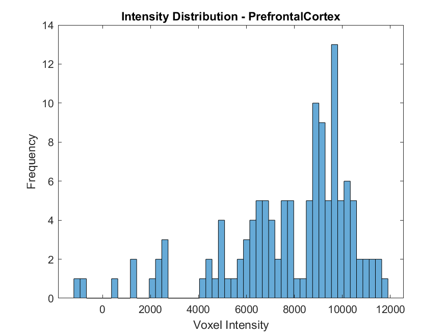
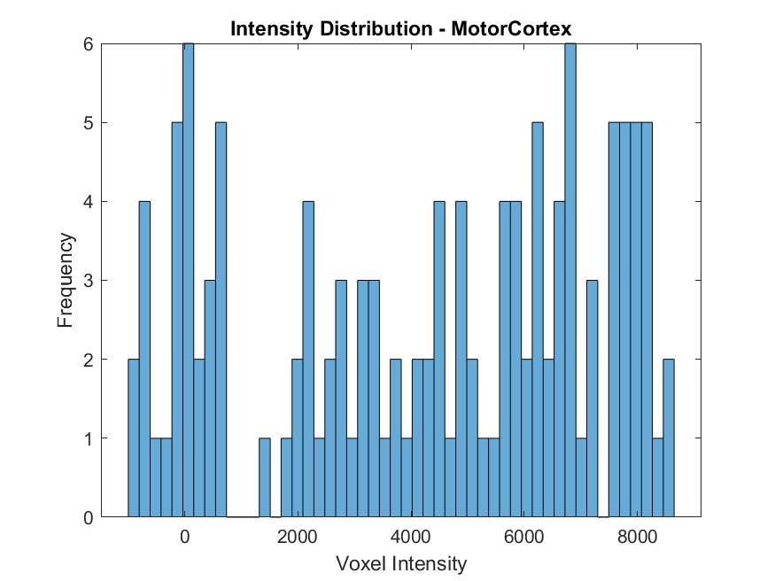
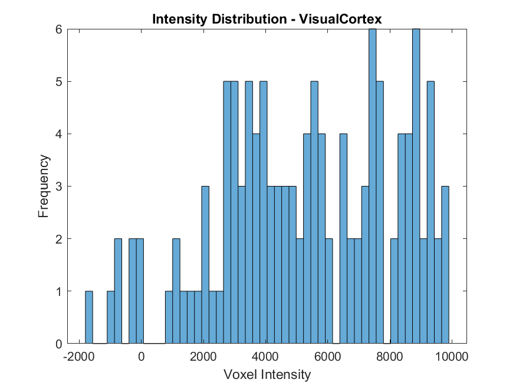

# fMRI Data Exploration and Visualization using MATLAB

This repository contains MATLAB scripts and Live Scripts (`.m` and `.mlx`) for analyzing and visualizing fMRI (functional MRI) data. The project aims to provide an introductory analysis of fMRI scans, including:

- Extracting voxel intensity information
- Visualizing different brain slices
- Identifying active brain regions
- Comparing different functional regions
- Saving results as images for further analysis

By working on this, I am not only developing a structured approach to analyzing fMRI data but also deepening my understanding of neuroimaging techniques and their applications.

---

## Key Visualizations
### 1. Colored fMRI Slice
This visualization applies a heatmap-like colormap (jet) to highlight intensity variations in a mid-brain slice.



---

### 2. Cortical Activation Map
This figure shows the most active brain regions by highlighting the top 10% of voxel intensities.



---

### 3. Brain Mask Overlay
A binary brain mask is applied to remove non-brain regions for clearer visualization.



---

### 4. Voxel Intensity Distributions in Key Brain Regions
The script extracts intensity values from specific brain regions and compares their distributions.

#### Prefrontal Cortex


#### Motor Cortex


#### Visual Cortex


---

## How the Code Works
The script performs the following steps:

1. **Load fMRI Data** – Reads `.nii` files and extracts metadata (voxel size, dimensions, etc.).
2. **Visualize Brain Slices** – Applies grayscale and colormap visualizations.
3. **Compute Activation Maps** – Highlights top 10% active brain voxels.
4. **Generate a Brain Mask** – Removes background noise for clearer imaging.
5. **Compare Different Brain Regions** – Extracts and compares intensity values from the Prefrontal Cortex, Motor Cortex, and Visual Cortex.
6. **Save All Outputs as PNGs** – Stores results in the `Results/` folder for easy review.

---

## How to Run the Code
### 1. Clone the Repository
```bash
git clone https://github.com/VaradhKaushik/fMRI-MATLAB-Demo.git
cd fMRI-MATLAB-Demo
```

### 2. Open in MATLAB
- Run `fMRI_demo_script.mlx` for an interactive Live Script experience.
- Run `fMRI_demo_script.m` for a standard script execution.

### 3. View Results
- The generated brain images are saved in the `Results/` folder.

---

## Author
**Varadh Kaushik**  
[GitHub Profile](https://github.com/VaradhKaushik)  
[LinkedIn Profile](https://www.linkedin.com/in/varadh-kaushik/)
